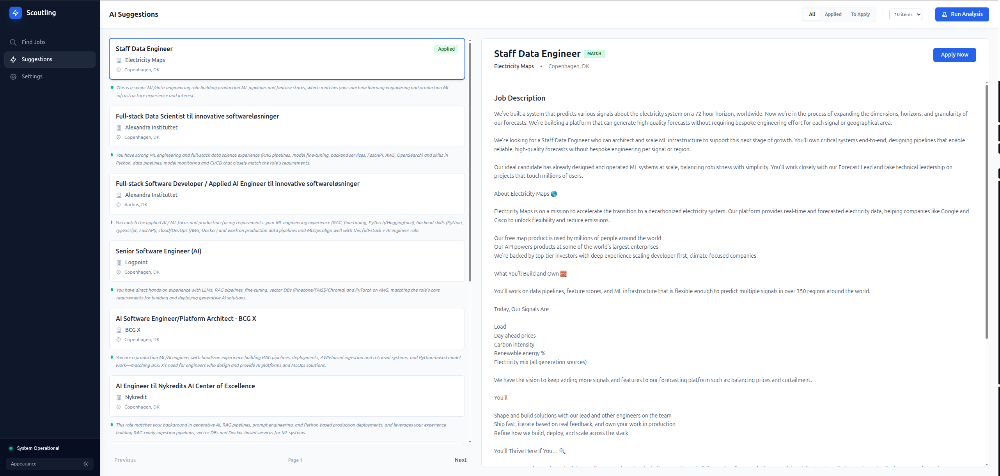

# 🧭 Scoutling

**Your AI-Powered Job Scout Assistant**

Scoutling is a full-stack application designed to streamline the job search experience. By leveraging AI agents, it aggregates, filters, and manages job listings to help you find the perfect role without the noise.

## ✨ Key Features

*   **🔍 Job Aggregation:** centralized view of job listings from LinkedIn (and potentially other sources).
*   **🤖 AI Filtering Agents:** Intelligent agents that analyze job descriptions against your resume and preferences to identify relevant opportunities.
*   **📝 Resume Analysis:** Upload your resume (Markdown supported) and let the system understand your profile.
*   **⚙️ Custom Preferences:** Define your target countries, job titles, and specific agent instructions (e.g., "Remote only", "No C++").
*   **🌗 Dark Mode:** A sleek, professional UI available in both Light and Dark themes.
*   **📊 Kanban-style Tracking:** Track jobs you've applied to and see which ones are "To Apply".